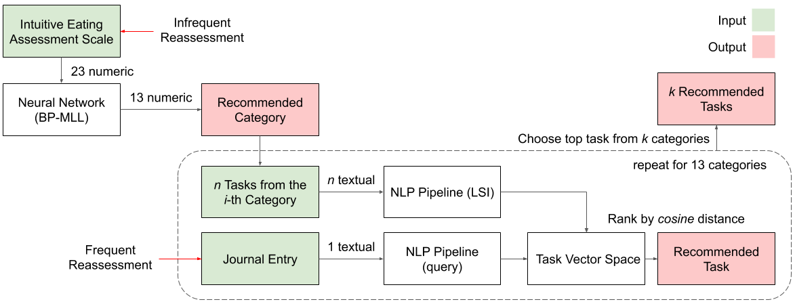

# Machine Learning Recommender Pipeline for FYDP
This repository will store any ML related work for Ambrosia.

It is a two part system:

1. ANN trained with BP-MLL
  * adapted from [M.-L. Zhang, Z.-H. Zhou. Multilabel neural networks with applications to functional genomics and text categorization. IEEE T. Knowl. Data En., 18 (10) (2006), pp. 1338-1351][1]

2. NLP pipeline with LSI
  * inspired by [C. Musto et al. Learning word embeddings from Wikipedia for content-based recommender systems. ECIR, (2016), pp.729-734][2]

  [1]: https://ieeexplore.ieee.org/abstract/document/1683770
  [2]: https://www.springer.com/gp/book/9783319306704